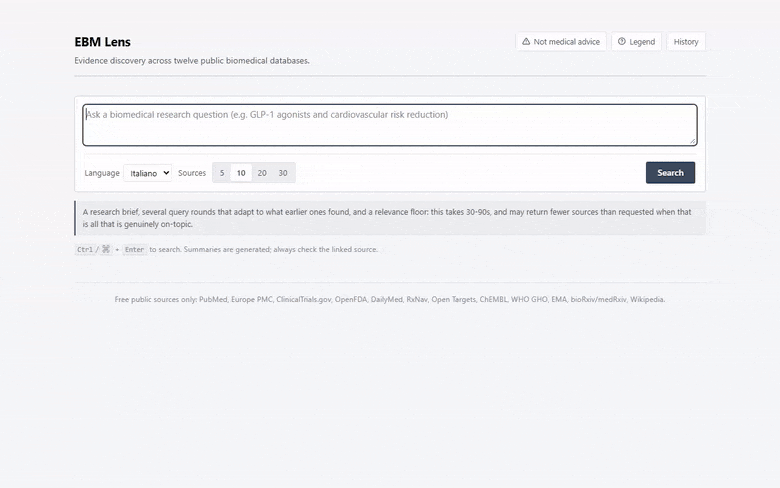
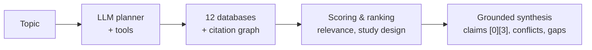

# EBM Lens

[](https://github.com/mauroforlin/ebm-lens/actions/workflows/ci.yml)
[](https://opensource.org/licenses/MIT)
[](https://mauroforlin.github.io/ebm-lens/)

[**Try the read-only demo**](https://mauroforlin.github.io/ebm-lens/): fifteen
recorded runs, no signup, no API key. See `demo/README.md` for how it's built.

Evidence discovery for biomedical questions. Give it a topic and it searches
twelve public biomedical databases, expands the result set through the
citation graph, ranks what it found by relevance and by study design, and
returns appraised sources plus an overview whose every claim cites the
sources under it.





Every evidence source is a free public API. The only account you need is for
the LLM.

## Example output

The [live demo](https://mauroforlin.github.io/ebm-lens/) has real, full
responses: ranked sources, the claims that cite them, the conflicts and gaps,
and the actual cost and timing behind each run.

## Background

EBM Lens started as a feature inside [Sbobby](https://www.sbobby.com), a
lecture-transcription product I built. That feature, "Approfondimenti",
searches a similar number of sources for the topics covered in a lecture and
has its own basic query planning and reranking. This repository is a full
rewrite of it: study-design ranking, citation verification and the
multi-round search loop are all new.

## Quick start

Cloning gets the full, live pipeline: free-text questions, any number of
sources, real-time search. The [hosted demo](https://mauroforlin.github.io/ebm-lens/)
is read-only, limited to fifteen precomputed questions, and good for a first
look.

Requires Python 3.10+.

```bash
git clone https://github.com/mauroforlin/ebm-lens.git
cd ebm-lens
python -m venv .venv
source .venv/bin/activate        # .venv\Scripts\activate on Windows
pip install -r requirements.txt

cp .env.example .env             # then set OPENROUTER_API_KEY
uvicorn app.main:app --reload
```

Open <http://localhost:8000> for the bundled UI, or call the API directly:

```bash
curl -X POST http://localhost:8000/api/related-articles \
  -H "Content-Type: application/json" \
  -d '{
        "topic": "GLP-1 agonists and cardiovascular risk reduction",
        "max_sources": 10,
        "summary_language": "en"
      }'
```

`/api/related-articles/stream` takes the same body and returns Server-Sent
Events instead of a single JSON response, if you want progress as it happens.

There is no database, no Redis, no job queue and no container to build. A
search runs synchronously inside the request.

### Configuration

Only `OPENROUTER_API_KEY` is required. Everything else has a working
default, see `.env.example`. Worth knowing about:

| Variable | Why you might set it |
|---|---|
| `CONTACT_EMAIL` | Goes in the `User-Agent`. NCBI, Crossref and OpenAlex give identified clients a more generous rate limit. |
| `NCBI_API_KEY` | Free, raises PubMed from 3 to 10 req/s. |
| `OPENFDA_API_KEY` | Free, raises openFDA from 1,000 to 120,000 requests/day. |
| `API_KEY` | If set, clients must send a matching `X-API-Key`. Set it before exposing the service beyond localhost. |
| `CORS_ALLOW_ORIGINS` | Only needed for a frontend on another origin. The bundled UI is same-origin. |

## How it works

### Twelve databases, one planned query each

Sending the same string to every provider wastes most of the calls: PubMed
wants MeSH-flavoured English, DailyMed wants a bare drug name, and so on.

An LLM **plans the search instead**, wording each query for the provider
it's going to, and checks its own work first. `probe_pubmed` runs a
candidate query and returns the hit count and PubMed's MeSH translation,
since PubMed expands the words it's given rather than searching them; a term
it doesn't recognise expands to nothing, looking exactly like a topic with no
literature behind it. If planning fails, a deterministic router picks
providers from the topic type instead: worse-targeted, but the pipeline
still answers.

### PICO, and composite topics searched per axis

Before anything is searched, the topic is put into Population, Intervention,
Comparison, Outcome form. Only the elements it actually states get filled
in; an invented comparator would send the search after literature nobody
asked about.

A topic spanning several axes ("CAR-T therapy, BBB disruption and ctDNA
monitoring in glioblastoma") gets a **query per axis** instead of one query
that returns whatever its most-published axis happens to be, so the
thinnest-literature axis isn't starved by the others.

### Multi-round discovery

A single query pass fails frontier topics two ways: seminal papers often use
vocabulary the phrasing doesn't contain, and a highly-cited paper about a
different sense of the same words can outrank what's actually on-topic.

So discovery runs as a loop: a research brief, several diverse query
variants, and only papers that clear a relevance gate seed citation-graph
expansion (seeding on the most-cited hit just expands around the wrong
paper). The loop reads its strongest results, extracts the vocabulary the
literature actually uses, and refines, stopping as soon as a round stops
surfacing new on-topic work.

### Ranking: relevance and study design, fused

Embeddings read meaning but compress a paper into one vector, so a rare
decisive term counts for about as much as any other word; BM25 has the
opposite blind spot. Both run, fused with citation authority, recency,
provider tier and an LLM reranker.

**Study design is scored separately**, since a case report and a
meta-analysis on the same subject are equally on-topic and not equally worth
believing. It's checked against the provider's own classification first,
then NLM's publication types, and only then the wording of the abstract, so
an unrecognised design scores neutral rather than low.

### Synthesis you can check, disagreement included

The overview comes back as claims, not prose: each one names the articles it
rests on, and a claim citing nothing real is dropped before it reaches the
response. Citation hallucination doesn't get fixed by a better prompt, so
it's checked in code instead.

Where sources disagree, **that disagreement is the finding**: conflicts come
back with the sources on each side named, rather than averaged into
something that reads like settled science.

### Progress and cost

A run takes 60-180 seconds: real multi-round search plus several LLM calls.
The streaming endpoint emits a frame per stage so the UI shows what's
actually running instead of a bare spinner, and every response carries a
`job_stats` breakdown: real cost, tokens, per-stage timing, per-source calls.

## What the model is allowed to do

Most of the pipeline is fixed: the stages, the providers, the ranking. Two
steps aren't, because the right move depends on facts nobody's looked up
yet, like which words a database indexes or what a brand name is actually
called. Those two run as **tool loops** instead of fixed code.

| Tool | Answers |
|---|---|
| `probe_pubmed(query)` | Hit count, PubMed's MeSH translation, the phrases it couldn't match. |
| `resolve_drug(name)` | The active molecule behind a brand name, via RxNorm. |
| `search_guidelines(topic)` | Real clinical practice guideline titles, via Europe PMC. |
| `submit_brief(...)` / `submit_queries(queries)` | Terminal tools: the brief and query batch as typed arguments, not prose to re-parse. |

Tool calls issued in the same turn run concurrently, and identical repeated
calls are served from a memo. When the round budget runs low, the terminal
tool is forced through `tool_choice`: "explored too long" turns into
"submits what it has." Every call is counted in `job_stats.tools`, so which
lookups the model actually reaches for is visible in the response.

## Layout

```
app/
  main.py          FastAPI app, static frontend, startup config
  config.py        settings (pydantic-settings, reads .env)
  schemas.py       request/response models and the internal TopicSpec
  api/             endpoints.py (sync + streaming routes), deps.py (API-key auth)

  core/            infrastructure that knows nothing about medicine
    llm_client.py    OpenRouter wrapper: model routing, retries, JSON repair,
                     tool-calling loop, cost capture
    embeddings.py    batched embeddings
    events.py        SSE progress events for the streaming endpoint
    cache.py         in-process TTL cache, LRU-bounded
    ratelimiter.py   in-process token/request limiter
    job_stats.py     per-run cost, token and timing accounting

  sources/         everything that talks to the outside world
    base.py          SourceProvider / SourceResult contract
    blocklist.py     domain quality gate applied to every result
    <12 providers>   one module each
    citation_expander.py   Semantic Scholar + OpenAlex neighbours
    content_extractor.py   full-text fetch, allowlisted hosts only

  pipeline/        the discovery logic
    orchestrator.py  entry point; the run, stage by stage
    topic_analysis.py  domain detection and composite decomposition
    searcher.py      the tiered multi-provider search
    agentic.py       the multi-round discovery loop
    dedup.py         source identity (DOI, then title, then URL)
    ranking.py       pure scoring functions and weight profiles
    relevance.py     builds per-candidate signal maps
    lexical.py       BM25 over the candidate pool, no index, no dependency
    evidence_grade.py  study design detection and the evidence hierarchy
    evidence_cache.py  whole-topic result cache, keyed on the normalised query
    selection.py     final ranking and selection policy
    synthesis.py     per-source appraisal and the grounded overview
    planner_tools.py the tools the model may call, and their dispatch

frontend/  index.html, app.js, style.css: plain files, no build step
```

## Design notes and limits

- **No persistence.** Caches are in-memory and reset on restart, which costs
  a slower first query afterwards and nothing else. `app/core/cache.py`
  exposes only `get`/`set`, so swapping in a Redis or SQLite backing is a
  single-module change.
- **Both caches match on exact hashes.** `evidence_cache.py`'s topic lookup
  and the per-provider cache in `cache.py` both normalise (lowercase, strip
  punctuation, sort words) before hashing, so word-order variants of the same
  question share an entry, but two genuinely different phrasings do not.
  Catching those needs embedding similarity over a vector store, the
  infrastructure this project deliberately does without. A miss just costs
  a slower response.
- **Single process.** Fine for local use or one container. Scaling
  horizontally means giving `cache.py` and `ratelimiter.py` a shared backend,
  since both are per-process today.
- **Summaries are a reading aid.** They exist to help decide which sources
  are worth opening. Every result also links back to its source, with
  provider, study design and reliability tier shown alongside it.
- **The design tier maps to GRADE's first input, nothing more.** GRADE grades
  a body of evidence for a specific question, weighing risk of bias,
  imprecision and indirectness, none of which this pipeline can see. What the
  ranker produces is the design tier, GRADE's first and largest input,
  reported by name so the rest of the appraisal can be applied by hand.
- **Fetched source text is untrusted input.** The pipeline pulls full page
  text from allowlisted hosts, including a user-editable one (Wikipedia), and
  passes it to an LLM that has tools available. The domain allowlist is the
  only control; nothing sanitises page content. Hardening that path is open
  work.

> [!IMPORTANT]
> **Citation checking stops at existence (working on it)**
> A claim citing an article that is not in the response gets dropped before the response is built. Whether a cited article actually supports the sentence citing it is left to the reader; the response links straight to the source for that check.

## Evaluation

`eval/` grades each pipeline stage against a public, externally-labelled
dataset, instead of one end-to-end judged score: retrieval and reranking
against BioASQ's PubMed relevance judgments, per-source stance and citation
grounding against SciFact's expert-labelled claims, and PICO extraction
against EBM-NLP's crowd-annotated abstracts.

```bash
python eval/retrieval_eval.py
python eval/pool_relevance_eval.py
python eval/pico_eval.py
python eval/stance_eval.py
```

Each script writes a resumable run to `eval/results/` and appends a row to
`eval/results/history.jsonl`, so a change to the pipeline can be compared
against the run before it. See `eval/README.md` for dataset provenance,
licensing and the caveats specific to each benchmark.

